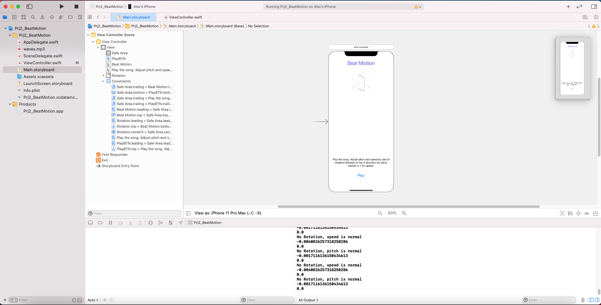
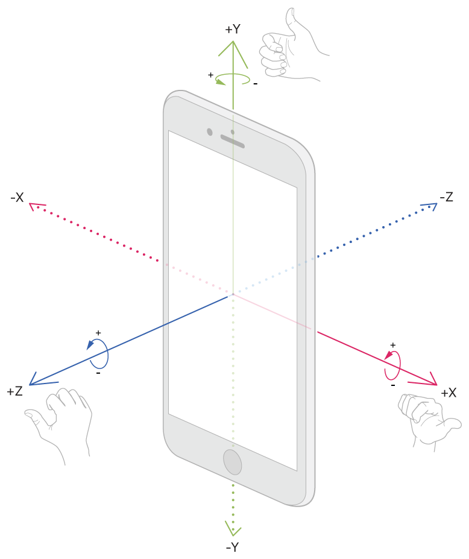

# Prj2_BeatMotion
Project 2 for MSCS 722. Uses gyroscope motion events to change pitch and speed of a song.

## Beat Motion
The game I chose to make is Beat Motion. You can use this applciation to modify the audio output of the provided song
First you play the song. You can adjust the pitch and speed by the rate of rotation. Rotation in the X axis for pitch, rotation in the Y axis for speed

### Screenshots
This is the development environment using my iPhone as a testing device.

This is the rotation axis.

